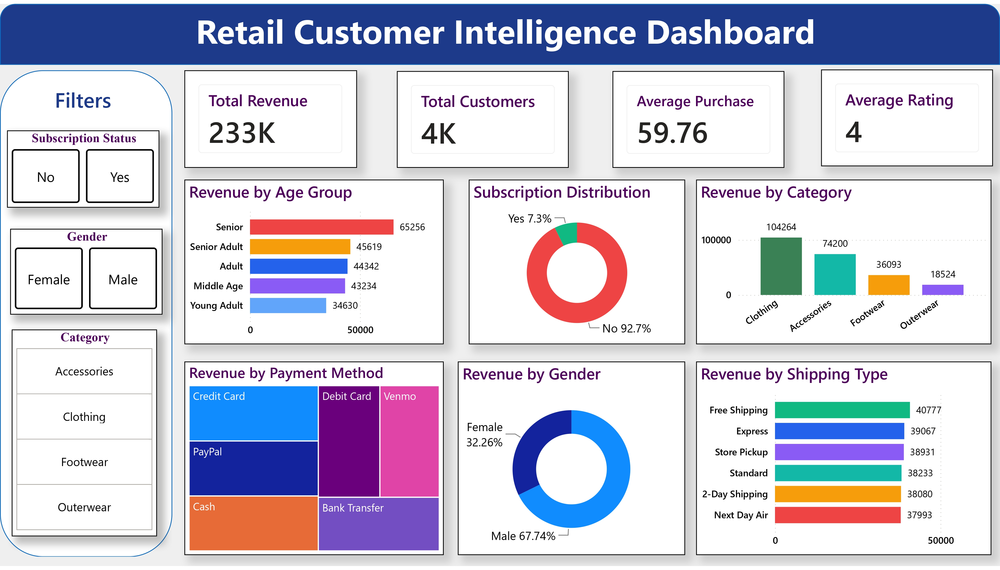

# 📊 Retail Customer Intelligence Dashboard

## 📌 Project Overview

The **Retail Customer Intelligence Dashboard** is an end-to-end data analytics project that analyzes customer purchasing behavior to generate actionable business insights. The project combines SQL for data analysis, Python for data cleaning and preprocessing, and Power BI for interactive dashboard creation. It helps businesses understand customer behavior, monitor sales performance, and make data-driven decisions.

---

## 🎯 Objectives

- Analyze customer purchasing patterns.
- Identify high-value customers.
- Track sales and revenue performance.
- Evaluate product performance.
- Build an interactive dashboard for business intelligence.

---

## 🛠️ Tech Stack

- **Python (Pandas, NumPy)**
- **SQL (PostgreSQL)**
- **Power BI**
- **Jupyter Notebook**
- **Microsoft Excel**

---

## 📂 Repository Contents

| File | Description |
|------|-------------|
| `customer_cleaned.csv` | Cleaned customer dataset used for analysis |
| `customer_shopping.ipynb` | Data cleaning and preprocessing using Python |
| `customer_behaviour_sql.pdf` | SQL queries and business analysis |
| `customer_behaviour_sql.pbix` | Interactive Power BI dashboard |
| `customer_behaviour_sql.jpg` | Dashboard preview |

---

## 🔄 Project Workflow

```
Raw Customer Data
        │
        ▼
Data Cleaning (Python)
        │
        ▼
SQL Analysis
        │
        ▼
Business KPIs
        │
        ▼
Power BI Dashboard
        │
        ▼
Business Insights
```

---

## 📊 Dashboard Highlights

- Total Revenue
- Total Orders
- Customer Segmentation
- Product Performance
- Sales Trends
- KPI Cards
- Interactive Filters & Slicers

---

## 💡 Key Business Insights

- Identified customer purchasing trends and spending behavior.
- Analyzed product performance across different categories.
- Evaluated sales and revenue metrics using SQL queries.
- Built an interactive dashboard for quick business decision-making.
- Generated actionable insights to support retail business strategy.

---

## 🚀 Skills Demonstrated

- Data Cleaning & Preprocessing
- SQL Query Writing
- Data Analysis
- Business Intelligence
- Power BI Dashboard Development
- KPI Design
- Data Visualization

---

## 📷 Dashboard Preview

## 📷 Dashboard Preview

Below is the interactive Power BI dashboard developed for this project.



---

## 🔮 Future Enhancements

- Customer Lifetime Value (CLV) Analysis
- RFM Customer Segmentation
- Sales Forecasting
- Real-Time Dashboard Integration
- Automated Data Refresh
